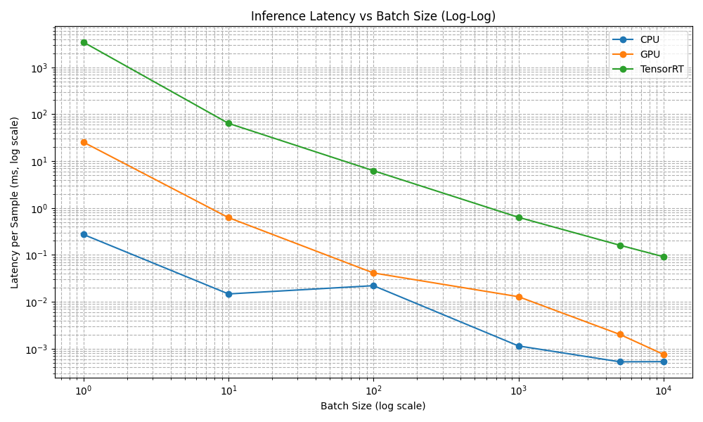

# ONNX + GPU Inference Optimization: Loan Default Risk Prediction

**Author**: Mario Lucido
**Goal**: This project benchmarks the GPU acceleration of a PyTorch-trained loan default classifier using ONNX Runtime and TensorRT. It evaluates how inference performance scales with batch size and engine type (CPU, CUDA, TensorRT) and look at key concerns in deploying real-world ML systems.

---

##  Dataset: Real-World Financial Classification

This project uses the [LendingClub Accepted Loans dataset (2007–2018)](https://www.kaggle.com/datasets/wordsforthewise/lending-club), which contains millions of anonymized loan applications.

- **Target**: Binary classification —  
  `0 = Fully Paid`, `1 = Charged Off`
- **Features** include:
  - `loan_amnt`, `term`, `int_rate`
  - `annual_inc`, `dti` (debt-to-income ratio)
  - `purpose` (categorical loan reason)
- Post-cleaning: ~2.6 million records

### Why this dataset?
Tabular data with high cardinality, mixed data types, and business-relevant features make this a strong proxy for production ML pipelines in financial services. It's ideal for analyzing inference behavior under various batch sizes.

---

## Pipeline Overview

1. **Preprocessing**: Missing value handling, categorical encoding, normalization  
2. **Modeling**:  
   - Trained a small feedforward network in **PyTorch**  
   - Exported to **ONNX** format  
3. **Inference Benchmarks**:
   - **ONNX Runtime CPU**  
   - **ONNX Runtime CUDA**  
   - **TensorRT (via ORT Execution Provider)**  
4. **Batching**: Tested performance from batch size 1 → 10,000  
5. **Visualization**: Log-log plot of latency vs. batch size  

---

## Latency Summary (milliseconds/sample)

| Batch Size | CPU    | GPU     | TensorRT |
|------------|--------|---------|----------|
| 1          | 0.273  | 25.335  | 3435.350 |
| 10         | 0.0148 | 0.625   | 63.988   |
| 100        | 0.0221 | 0.0413  | 6.257    |
| 1,000      | 0.0011 | 0.0129  | 0.635    |
| 5,000      | 0.0005 | 0.0020  | 0.161    |
| 10,000     | 0.0005 | 0.0008  | 0.092    |

- **CPU** has higher latency at small batch sizes but scales well  
- **GPU (CUDA)** shows speedup after batch size ≥ 100  
- **TensorRT** dominates at large batch sizes but has high warm-up time  

## Explaining the Latency Trends

At small batch sizes, **CPU inference is faster**. This is because:

- CPUs are optimized for low-latency, sequential tasks and have minimal startup overhead.
- GPUs introduce extra time for:
  - Data transfer between CPU and GPU memory
  - Kernel launch overhead
  - Engine warm-up (especially in TensorRT)

As a result, for simple models and tiny batches, GPU inference is actually slower than CPU.

However, as batch size increases, **GPU and TensorRT performance rapidly improves**:

-  Overheads become negligible compared to total work
-  GPUs excel at parallel processing, handling thousands of inputs efficiently
-  TensorRT shines once warmed up, delivering ultra-low per-sample latency at scale

This behavior is typical of real-world ML deployment: **CPUs are better for small, fast predictions; GPUs dominate when throughput and scale matter.**

---

## Log-Log Scaling Curve




---
## Why This Matters for Systems Engineering

This project simulates core deployment tradeoffs:

- *Latency vs Throughput*: CPU is efficient for micro-batching; GPU excels in bulk  
- *Inference Engine Selection*: TensorRT is ideal for large, static batch loads  
- *Memory + Kernel Launch Overhead*: TensorRT has cold-start cost, amortized over batch size  
- *Scalability*: GPU utilization improves with increased parallelism  

---

## Future Extensions

To deepen system-level benchmarking:

- **Heavier Models**:
  - Vision: ResNet, EfficientNet
  - NLP: BERT, DistilBERT, ViT
  - Time Series: LSTM, GRU, TCN

- **Optimization Experiments**:
  - Quantization to INT8 (ONNX + TensorRT)
  - Mixed-precision FP16 vs FP32 comparisons
  - Engine caching and cold-start timing
  - Real-time GPU profiling with `nvidia-smi` + `nvprof`

---

## Tech Stack

- **PyTorch** — model training  
- **ONNX** — model export and format conversion  
- **ONNX Runtime** — inference on CPU and CUDA  
- **TensorRT** — high-performance inference backend  
- **Matplotlib** — benchmark visualization  
- **NumPy + Pandas** — data preprocessing  

---

## Takeaways

This project demonstrates how inference pipelines behave at scale, showcasing a full stack of:

- Model export and conversion  
- ONNX GPU optimization  
- Batching-aware system performance  
- Visualization of real latency trends  

---
##  How to Run This Project

### Prerequisites

- Python 3.9+ (recommended)
- [PyTorch](https://pytorch.org/get-started/locally/)
- [ONNX Runtime](https://onnxruntime.ai/)
- (Optional) [TensorRT](https://developer.nvidia.com/tensorrt) for GPU optimization
- NVIDIA GPU with CUDA support (for GPU/TensorRT benchmarks)

---

### Setup Instructions

```bash
# 1. Clone the repo and enter it
git clone https://github.com/your-username/loan-risk-gpu-vs-cpu.git
cd loan-risk-gpu-vs-cpu

# 2. Create and activate a virtual environment
python -m venv venv
source venv/bin/activate         # Mac/Linux
# .\venv\Scripts\activate        # Windows

# 3. Install dependencies
pip install -r requirements.txt

# 1. Preprocess the dataset (from Kaggle CSV)
py scripts/preprocess.py

# 2. Train the PyTorch model
py scripts/train.py

# 3. Export the model to ONNX format
py scripts/export_to_onnx.py

# 4. Simplify the ONNX graph (optional but recommended)
py scripts/simplify_onnx.py

# 5. Run benchmark (CPU, GPU, TensorRT)
py scripts/benchmark.py

# 6. Plot performance scaling vs batch size
py scripts/plot_batch_scaling.py


Notes
Place the raw LendingClub CSV in data/raw/

Models, plots, and logs are ignored in .gitignore and stored in /models/

Your ONNX model supports dynamic batch sizes out of the box

You can modify scripts to test larger models (e.g., ResNet, BERT)

